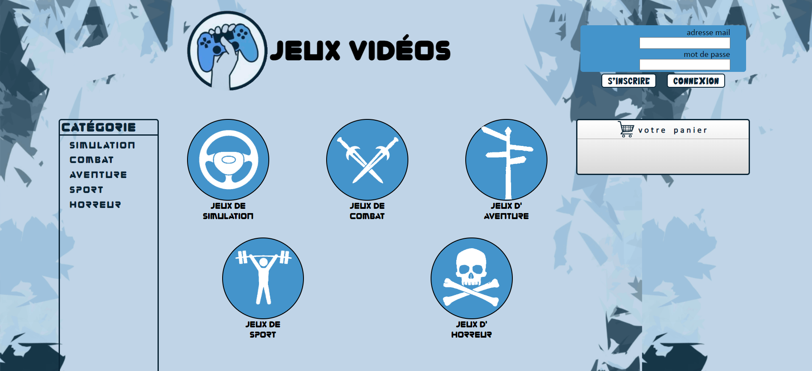
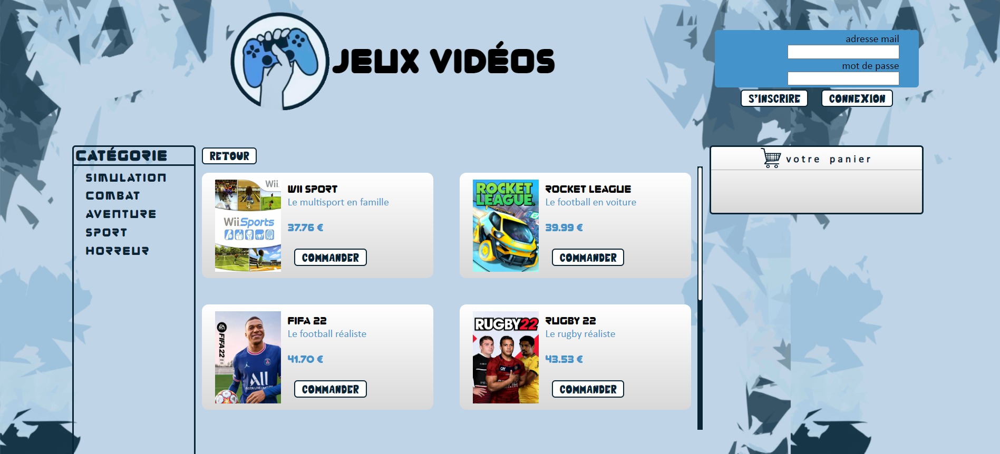

# Site de vente des jeux-vidéo

## L'application web

Ce projet nécessite l'installation de [XAMPP](https://www.apachefriends.org/fr/download.html) et [PostgreSQL](https://www.postgresql.org/download/).

### Étapes d'installation :
1. Installer XAMPP.
2. À la fin de l'installation, XAMPP se lance puis démarrer les modules `Apache` et `MySQL` en cliquant sur `Start`.

### Configuration initiale :
1. Se déplacer vers le répertoire : 
    ```bash
    cd C:/xampp/htdocs
    git clone https://github.com/OussamaLay/Game-Project.git
    ```
#### Traitement des fichiers CSV :
En cas d'erreur de lecture des fichiers CSV, ouvrez le terminal dans le dossier du projet et exécutez la commande suivante :
```bash
python Data/CsvToPgSQL.py
```

2. Créer la base de données :
    - Suivre cette vidéo [lien vers la vidéo](https://www.youtube.com/watch?v=oNJpktM65eY) en remplaçant le nom de la base de données par : `jeux-video` et le nom de l'utilisateur par : `gamer`.
    - Ou, utiliser PgAdmin :
        - Lancer et connecter PgAdmin.
        - Clic droit sur la base de données `Databases` -> `Create` -> `Database`, remplir le nom de la base de données par : `jeux-videos`, puis cliquer sur `Save`.
        - Clic droit sur `jeux-videos` -> `Query Tool`, puis importer le fichier (Ouvrir le fichier) `C:\xampp\htdocs\Game-Project\Site\JeuxVid.sql` et exécuter.
        - Clic droit sur `jeux-videos` -> `PLSQL Tool`, puis exécuter :
            ```bash
            CREATE USER gamer WITH PASSWORD '00000';
            ALTER ROLE gamer WITH LOGIN;
            GRANT ALL PRIVILEGES ON DATABASE "jeux-videos" TO gamer;
            GRANT SELECT, INSERT, UPDATE, DELETE ON article TO gamer;
            GRANT SELECT, INSERT, UPDATE, DELETE ON categorie TO gamer;
            GRANT SELECT, INSERT, UPDATE, DELETE ON panier_article  TO gamer;
            ```

### Accès au site web :
Le site web est disponible via le lien : `http://localhost/Game-Project/Site/`

## L'analyse des Ventes avec Power BI :

Le dashboard Power BI fournit une vision détaillée des performances de ventes de jeux vidéo, extraites du site web de commerce. Voici quelques points clés de l'analyse effectuée :

- **Catégories de Jeux Populaires :** Une visualisation interactive permet de découvrir les catégories de jeux les plus appréciées par les clients, aidant à cibler efficacement les préférences du public.

- **Années Performantes :** Le dashboard met en lumière les années les plus performantes en termes de ventes, permettant une réflexion sur les facteurs qui ont contribué à ces succès.

- **Top Jeux Vendus :** Une section dédiée aux jeux les plus vendus offre une perspective sur les titres qui ont connu le plus grand succès commercial.

- **Analyse des Tranches d'Âge :** Une visualisation des tranches d'âge des clients permet de mieux comprendre le public cible, facilitant ainsi le ciblage marketing.

L'intégration de ces analyses offre une compréhension approfondie des tendances du marché des jeux vidéo, guidant ainsi les décisions stratégiques pour maximiser les performances de vente.




